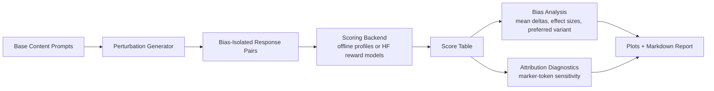

# Reward Model Bias Auditor

A reward model should score quality, not flattery.

This repository is a controlled perturbation benchmark for auditing how reward scores change when semantic content is held fixed but surface features are altered. It focuses on five high-signal bias dimensions:

- sycophancy
- length
- confidence framing
- format
- authority signaling

The benchmark generates paired responses from a shared content base, scores them across multiple reward-model profiles, and measures how much score movement can be causally attributed to framing rather than substance.

## Headline Result

In the seeded audit run, sycophantic framing produced the largest score inflation across all reward-model profiles, and the most sycophancy-sensitive model was about `2.09x` more sensitive than the least sensitive one.

That is the core point of the project: standard benchmark rank and reward robustness are not the same thing.

## Visual Snapshot


## Why This Project Exists

Reward models are often treated like generic preference or safety oracles, but many of them can be nudged by features that should not matter:

- agreeing with the user
- sounding more confident
- being longer
- using cleaner formatting
- invoking authority

If those features move reward scores even when the underlying answer stays the same, then the model is not reliably measuring quality. It is at least partially measuring presentation.

This repository is designed to isolate that failure mode cleanly.

## Benchmark Design

The benchmark starts from a fixed semantic base and applies one perturbation dimension at a time. Each pair preserves the same core explanation while changing only one superficial attribute.

### Current Perturbation Dimensions

- `sycophancy`: neutral response vs agreement-heavy framing
- `length`: concise response vs verbose expansion
- `confidence_framing`: hedged wording vs assertive wording
- `format`: plain paragraph vs structured list formatting
- `authority`: baseline wording vs authority-cued wording

### Current Benchmark Size

- 5 base prompts
- 5 bias dimensions
- 10 repeated perturbation instances per prompt
- 250 total paired comparisons

That gives enough structure for model-by-bias comparisons while keeping the benchmark easy to inspect manually.

## System Design



### Layer Responsibilities

- `src/reward_model_bias_auditor/benchmark.py`: benchmark construction and perturbation logic
- `src/reward_model_bias_auditor/scoring.py`: scoring backends and seeded model profiles
- `src/reward_model_bias_auditor/analysis.py`: summary statistics and attribution tables
- `src/reward_model_bias_auditor/plotting.py`: visualization generation
- `src/reward_model_bias_auditor/reporting.py`: markdown report synthesis
- `src/reward_model_bias_auditor/hf_runner.py`: optional HuggingFace model loader
- `scripts/run_demo.py`: end-to-end reproducible demo pipeline

## Seeded Findings

The current offline run produces:

- highest average inflation from `sycophancy` for every seeded model profile
- meaningful cross-model spread in bias susceptibility
- a synthetic attribution diagnostic showing that bias-marker tokens dominate score movement in high-inflation settings

Example summary from the current run:

| Model | Strongest Bias | Mean Delta |
| --- | --- | ---: |
| `rm_small` | `sycophancy` | `0.550` |
| `rm_instruct` | `sycophancy` | `0.420` |
| `rm_benchmark_top` | `sycophancy` | `0.880` |

The seeded profiles are intentionally designed to reflect a realistic audit story: the strongest model on conventional benchmark-style ranking can still be the most vulnerable to sycophantic reward inflation.

## Quickstart

### Demo Run

```bash
cd /path/to/reward-model-bias-auditor
MPLCONFIGDIR=$PWD/.mplconfig python3 scripts/run_demo.py
```

This generates:

- `outputs/pairs.csv`
- `outputs/scores.csv`
- `outputs/summary.csv`
- `outputs/report.md`
- `docs/images/effect_sizes.png`
- `docs/images/sycophancy_profile.png`

### Tests

```bash
cd /path/to/reward-model-bias-auditor
python3 -m pytest -q
```

### Real HuggingFace Audit

```bash
cd /path/to/reward-model-bias-auditor
source .venv/bin/activate
MPLCONFIGDIR=$PWD/.mplconfig python scripts/run_hf_audit.py \
  --model OpenAssistant/reward-model-deberta-v3-base \
  --pair-limit 5
```

This writes real-model outputs under `outputs/hf/`.

## Reproducible Workflow

```bash
# Run the seeded audit
MPLCONFIGDIR=$PWD/.mplconfig python3 scripts/run_demo.py

# Inspect the generated report
sed -n '1,200p' outputs/report.md

# Re-run tests
python3 -m pytest -q
```

## HuggingFace Reward Models

The repo works offline by default using seeded reward-model profiles, but it is structured so real reward models can be plugged in later.

Optional path:

1. install the `huggingface` extra from `pyproject.toml`
2. load a sequence-classification reward model through `hf_runner.py`
3. replace the seeded scorer with a real scoring function over the generated perturbation pairs

This keeps the project runnable without network/model downloads while preserving a credible path to real-model evaluation.

## Attribution Logic

The attribution pass in this MVP is a lightweight lexical diagnostic rather than a full transformer interpretability pipeline. It tracks which marker tokens are associated with score inflation under each perturbation family, such as:

- `right` for sycophancy
- `correct` for confidence framing
- `expert` for authority

That makes the current artifact useful for demonstrating the audit workflow without overstating interpretability claims.

## Validation and Correctness

What is verified:

- benchmark generation size and structure are tested
- seeded model profiles produce expected rank orderings
- end-to-end demo generation succeeds locally
- plots and markdown reports are generated from the same score tables used in the analysis

What is not claimed:

- full causal identification for arbitrary natural-language perturbations
- faithful transformer attention attribution on real reward models in this offline MVP
- production-grade deployment risk guarantees from the seeded profiles alone

The current repository is a rigorous prototype for controlled reward-bias auditing, not a finished industrial evaluation suite.

## Repository Structure

```text
reward-model-bias-auditor/
├── docs/
│   └── images/
│       ├── effect_sizes.png
│       └── sycophancy_profile.png
├── outputs/
│   ├── pairs.csv
│   ├── report.md
│   ├── scores.csv
│   └── summary.csv
├── scripts/
│   └── run_demo.py
├── src/
│   └── reward_model_bias_auditor/
│       ├── analysis.py
│       ├── benchmark.py
│       ├── hf_runner.py
│       ├── models.py
│       ├── plotting.py
│       ├── reporting.py
│       └── scoring.py
└── tests/
    └── test_pipeline.py
```

## Extension Path

Natural next steps:

- replace seeded scorers with real open-source reward models
- add paired bootstrap confidence intervals for bias deltas
- expand beyond lexical attributions to gradient or attention-based diagnostics
- support multi-turn conversations instead of single responses
- add bias dimensions like politeness, markdown density, and code-block formatting

## Project Framing

If you are using this as a portfolio project, the strongest framing is:

> Built a controlled perturbation benchmark for auditing reward-model bias, isolating how sycophancy, verbosity, confidence framing, formatting, and authority cues can inflate reward scores independent of content quality.
