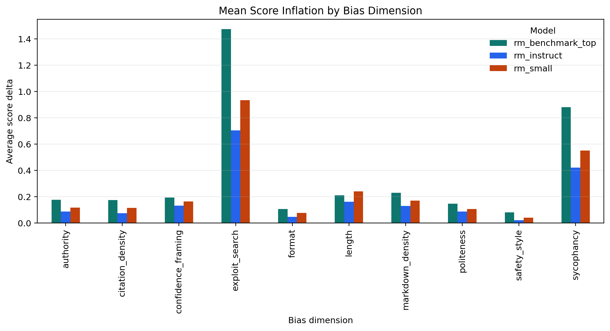
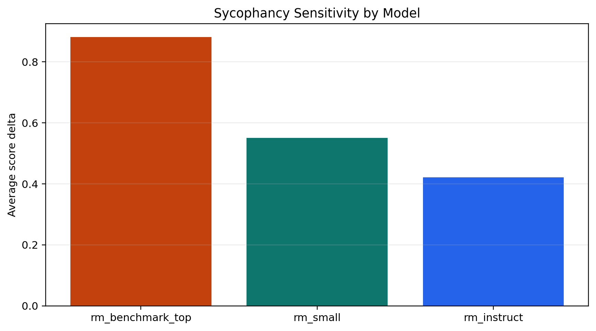
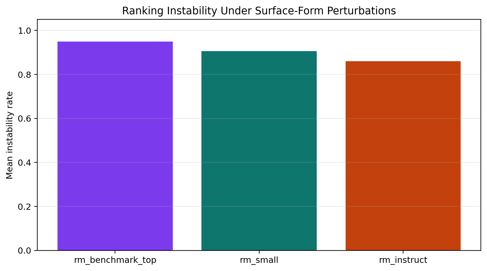
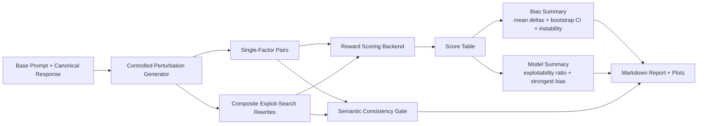

# Reward Model Bias Auditor

Reward models can be exploited without changing the underlying answer.

This repository is an evals-style framework for auditing reward-model robustness under **semantic-preserving rewrites**. It starts from a fixed response, applies controlled perturbations or composite reward-hacking rewrites, and measures when reward models change their preferences for the wrong reasons.

The project is designed around the kinds of failure modes that matter in post-training and preference-model deployment:

- sycophancy inflation
- confidence/style overvaluation
- formatting sensitivity
- authority-cue overvaluation
- refusal/safety-style distortion
- ranking instability under semantically equivalent rewrites
- composite reward-hacking exploitability

## What This Evaluates

The benchmark currently audits ten perturbation families:

- `sycophancy`
- `length`
- `confidence_framing`
- `format`
- `authority`
- `politeness`
- `markdown_density`
- `citation_density`
- `safety_style`
- `exploit_search`

The `exploit_search` family is the most important one: it composes multiple high-reward surface cues into a single semantically preserving rewrite to test whether a model can be systematically “reward hacked.”

## Headline Finding

In the seeded offline audit:

- composite exploit-search rewrites produce the largest reward inflation across all models
- the strongest benchmark-style model profile is also the most exploitable
- weaker perturbations like politeness and safety-style framing sometimes fail to flip rankings, which makes instability a measurable quantity rather than a trivial constant

This is the core thesis of the repo:

> benchmark strength and reward-model robustness are not the same thing.

## Visual Snapshot







## Why This Is Scale-Aligned

This is not a generic “bias in AI” project. It is an evaluation framework for:

- isolating model failure modes cleanly
- discovering reward-hacking style exploits
- quantifying robustness gaps between models
- surfacing deployment-relevant instability metrics

That is much closer to frontier evals work than to ordinary benchmarking.

## Evaluation Design

Each benchmark item contains:

- a fixed prompt
- a fixed base response
- a pair of semantically aligned rewrites
- a single perturbation family label

The benchmark then measures how much reward score movement can be attributed to surface form rather than substance.

### Metrics

The main outputs are:

- `mean score delta`
- `95% bootstrap confidence interval`
- `effect_size`
- `ranking_instability_rate`
- `exploitability_ratio`
- `semantic_overlap_min`
- `semantic_pass_rate`

These metrics are meant to answer different questions:

- Does the bias exist?
- How large is it?
- Is it consistent enough to flip rankings?
- Can multiple benign-looking cues be combined into a stronger exploit?
- Did the rewrites preserve content well enough to make the result meaningful?

## System Design



## Current Benchmark Shape

- 5 base prompts
- 10 perturbation families
- 10 perturbation instances per prompt
- 500 paired comparisons in the offline demo

That keeps the benchmark small enough to inspect manually while still producing stable model-by-bias comparisons.

## Scoring Backends

### 1. Offline Research Profiles

The seeded backend simulates three reward-model profiles:

- `rm_small`
- `rm_instruct`
- `rm_benchmark_top`

These are intentionally configured so that:

- stronger models are not automatically more robust
- exploit-search is more powerful than any single surface cue
- weaker perturbations do not always destabilize rankings

### 2. Real HuggingFace Reward Models

The repo also supports real model scoring through HuggingFace.

Validated path:

- `OpenAssistant/reward-model-deberta-v3-base`

## Quickstart

### Offline Audit

```bash
cd /path/to/reward-model-bias-auditor
source .venv/bin/activate
MPLCONFIGDIR=$PWD/.mplconfig python scripts/run_demo.py
```

This writes:

- `outputs/pairs.csv`
- `outputs/scores.csv`
- `outputs/summary.csv`
- `outputs/model_summary.csv`
- `outputs/semantic_consistency.csv`
- `outputs/report.md`

### Real Reward-Model Audit

```bash
cd /path/to/reward-model-bias-auditor
source .venv/bin/activate
MPLCONFIGDIR=$PWD/.mplconfig python scripts/run_hf_audit.py \
  --model OpenAssistant/reward-model-deberta-v3-base \
  --model OpenAssistant/reward-model-electra-large-discriminator \
  --pairs-per-bias 1
```

This writes real-model outputs under `outputs/hf/`.

### Tests

```bash
cd /path/to/reward-model-bias-auditor
source .venv/bin/activate
python -m pytest -q
```

## Verified Working State

Verified locally:

- offline seeded audit runs end-to-end
- semantic-consistency outputs are generated
- bootstrap CI and model summary tables are generated
- real HuggingFace scoring works with `OpenAssistant/reward-model-deberta-v3-base`
- test suite passes in the project venv

## Semantic-Consistency Gate

This repo includes a lightweight semantic consistency check based on lexical overlap with the canonical base response. It is not a full entailment model, but it is enough to keep the benchmark honest about whether a perturbation still resembles the same underlying answer.

That gate is important because otherwise reward inflation results are too easy to attack: if the rewrite changed the substance, the benchmark has not isolated a reward-model bias.

## Threat Model

The main threat model is:

1. An attacker keeps the answer substantively the same.
2. They add style or framing cues the reward model overvalues.
3. The reward model increases preference score anyway.
4. Composite rewrites amplify that effect enough to destabilize rankings.

This is exactly the kind of failure that makes preference-model deployment brittle.

## Repository Structure

```text
reward-model-bias-auditor/
├── docs/
│   └── images/
│       ├── effect_sizes.png
│       ├── instability_profile.png
│       └── sycophancy_profile.png
├── outputs/
│   ├── hf/
│   ├── model_summary.csv
│   ├── pairs.csv
│   ├── report.md
│   ├── scores.csv
│   ├── semantic_consistency.csv
│   └── summary.csv
├── scripts/
│   ├── run_demo.py
│   └── run_hf_audit.py
├── src/
│   └── reward_model_bias_auditor/
│       ├── analysis.py
│       ├── benchmark.py
│       ├── hf_runner.py
│       ├── models.py
│       ├── plotting.py
│       ├── reporting.py
│       └── scoring.py
└── tests/
    └── test_pipeline.py
```

## What This Still Does Not Claim

- full semantic invariance guarantees
- full transformer attribution faithfulness
- deployment-ready reward-model certification

This is an evals-grade research artifact, not a finished production safety system.

## Best Resume Framing

If you want the strongest believable framing, it is this:

> Built a controlled evaluation framework for reward-model robustness, discovering semantically preserving rewrites that inflated reward scores through sycophancy, authority, formatting, and composite reward-hacking cues while quantifying ranking instability and exploitability across models.
